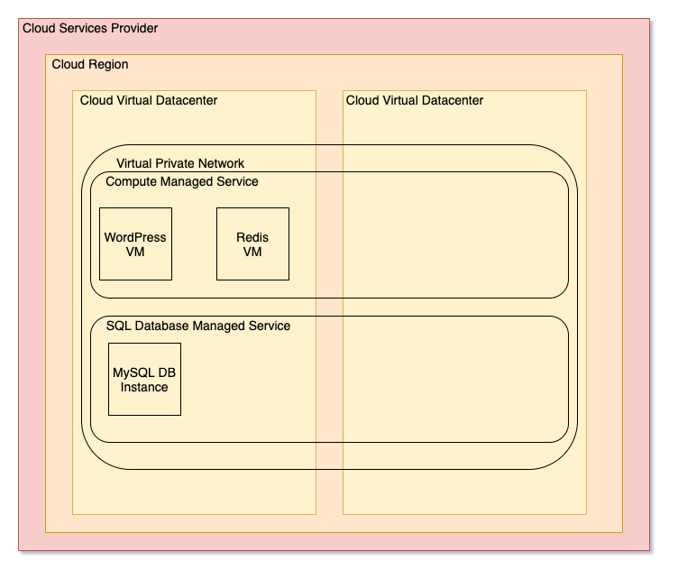

# Goal
Using IaC get a working deployment of WordPress connecting to an external database and a cache server ready to be used.

# Requirements
- Use VM for WordPress and Redis instances
- Use Cloud provider database managed service
- Install WordPress 5.0.10 or newer
- Run PHP 7 or newer
- Single datacenter (non HA)
- New dedicated virtual private network
- Allow SRE/DevOps to connect via SSH for troubleshooting
- Redis server listening on the default port and with no authentication

# Architecture


This is the architecture design for solution implementation. It is designed to be non HA and single datanceter on porpuse.

## Components
The following components compose the architecture:
- One virtual private network and its subnets
- One virtual machine for web
- One virtual machine for caching
- One MySQL database as a service

# Exam
## Prerequisites
1) Free tier AWS account
1) Public github repository

## Task
Using Infrastructure as Code (any language and tools of your choice) deploy sthe ame stack to AWS

## Deliverable
1) Put the code to your personal github repository under task3/ folder and share the link
1) Put the screenshot proving (screenshot1.png) that application runs on AWS (Wordpress Admin Config Page)
1) Make sure to share the terraform.tfstate securely after deployment succeed

## Deploy GCP environment 

### Prerequisites
1) Free tier GCP Account with Organization [enabled](https://cloud.google.com/resource-manager/docs/creating-managing-organization#acquiring)
1) Terraform 0.12.29
1) Google Cloud SDK (gcloud)

### GCP Roles
* Cloud SQL Admin
* Compute Network Admin
* Folder Admin
* Project Creator

These roles must be assigned at organization level for sake of simplicity.

### Shell variables

Export variables with your GCP account information
* TF_VAR_billing_account
* TF_VAR_org_id
* TF_VAR_parent (format organizations/org_id)

### Deployment

Perform the following steps in order to deploy the GCP solution:
```
$ gcloud init
$ MY_EMAIL=you@domain.com
$ export GOOGLE_APPLICATION_CREDENTIALS=$HOME/.config/gcloud/1)$ cy_credentials/$MY_EMAIL/adc.json
$ terraform init
$ terraform plan
$ terraform apply
```
